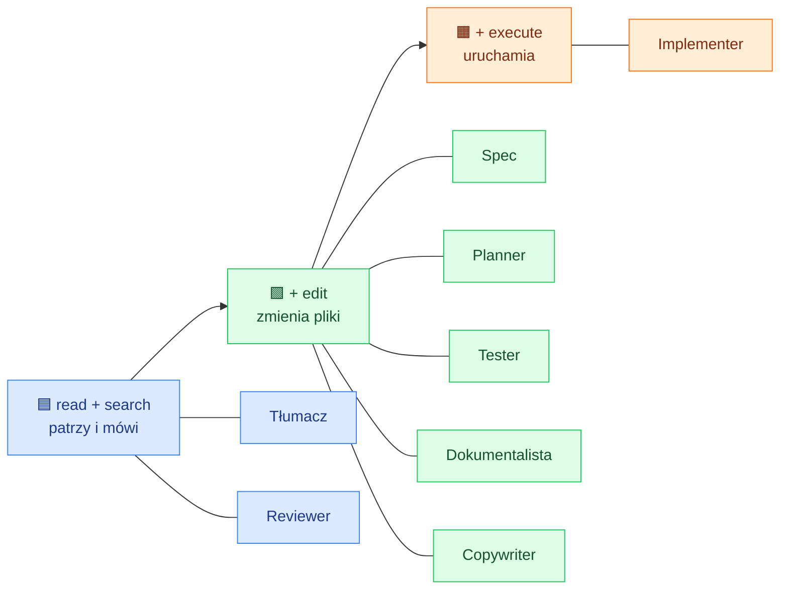
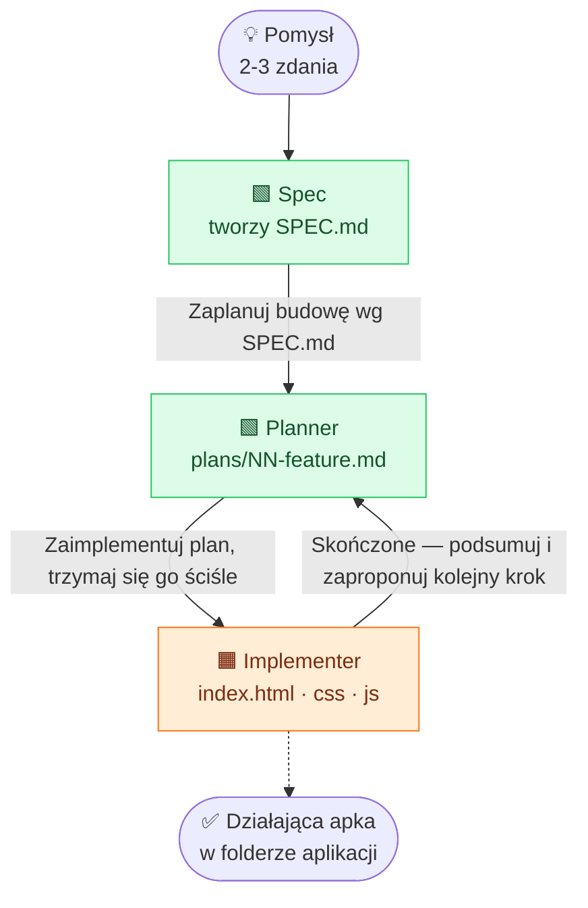
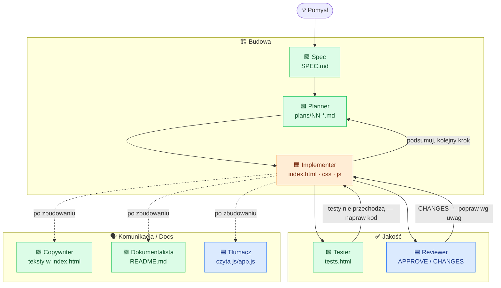
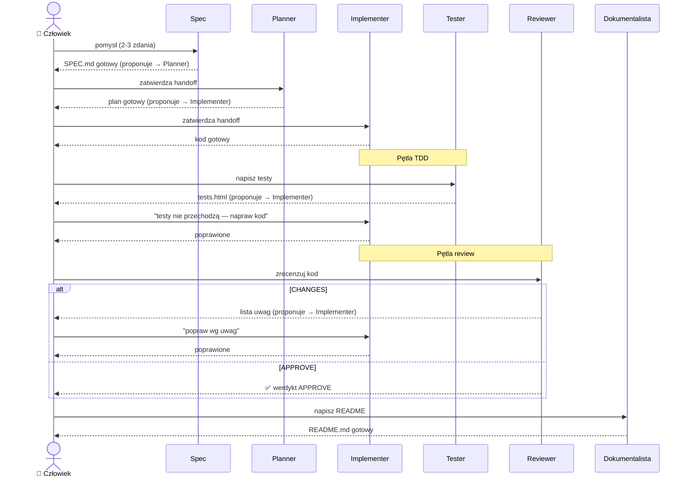
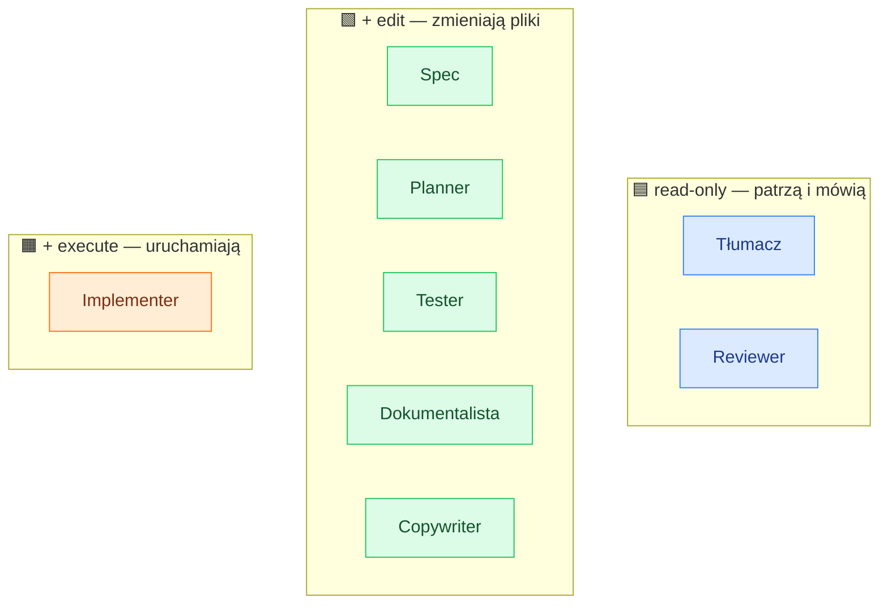

# Agenci warsztatowi — jak współpracują (diagramy)

Materiał wizualny do bloku o **custom agents** w GitHub Copilot. Pokazuje, jak
trzej istniejący agenci z [.github/agents/](../.github/agents/) i pięć pomysłów ze
[ściągawki](pomysly-na-agentow.md) wpinają się we wspólny cykl pracy nad aplikacją.

## Jedna pointa: `tools` = rola

Wszyscy ci „agenci" to ten sam mechanizm. Różni ich tylko **zestaw narzędzi (`tools`)**
i system prompt:

- **read-only** (`read`, `search/codebase`) → agent **patrzy i mówi**, nie ruszy kodu.
- **+ `edit`** → agent **zmienia pliki**.
- **+ `execute`** → agent **uruchamia** (rzadko potrzebne przy vanilla HTML).

Legenda kolorów używana w diagramach niżej:

- 🟦 **read-only** — Tłumacz, Reviewer
- 🟩 **+ edit** — Spec, Planner, Tester, Dokumentalista, Copywriter
- 🟧 **+ execute** — Implementer

## Tabela agentów

| Agent | `tools` | Co robi | Handoff → |
|---|---|---|---|
| **Spec** | `search/codebase`, `read`, `edit` | 2-3 zdania pomysłu → `aplikacje/<nazwa>/SPEC.md` | → Planner |
| **Planner** | `search/codebase`, `search/usages`, `edit`, `read` | czyta `SPEC.md` → pisze `plans/NN-feature.md` | → Implementer |
| **Implementer** | `edit`, `execute`, `search/codebase`, `read` | wykonuje plan → `index.html` / `css` / `js` | ↺ Planner |
| **Tester** | `search/codebase`, `read`, `edit` | pisze asercje w `tests.html`; nie rusza `js/app.js` | → Implementer |
| **Reviewer** | `search/codebase`, `read` | recenzuje kod → werdykt `APPROVE` / `CHANGES` | → Implementer |
| **Tłumacz** | `search/codebase`, `read` | tłumaczy `js/app.js` na prosty polski | — |
| **Dokumentalista** | `search/codebase`, `read`, `edit` | pisze `README.md` aplikacji | — |
| **Copywriter** | `search/codebase`, `read`, `edit` | poprawia teksty w `index.html` | — |

> **`handoffs` + `send: false`** — agent **podsuwa** gotowy prompt do następnego agenta,
> ale to **człowiek zatwierdza** przekazanie. Strzałki na diagramach to właśnie te handoffy.

---

## Diagram 1 — Spektrum narzędzi = rola

Drabinka uprawnień: każdy kolejny szczebel dokłada jedno narzędzie i zmienia to, co agent może zrobić.



---

## Diagram 2 — Rdzeń: cykl życia aplikacji

Istniejący łańcuch handoffów z [.github/agents/](../.github/agents/). Etykiety strzałek to
skróty realnych promptów z pól `handoffs`.



---

## Diagram 3 — Pełen zespół wokół cyklu

Rdzeń (Spec → Planner → Implementer) w centrum. Wokół niego wpinają się nowe role:
**Tester** i **Reviewer** domykają jakość, a **Copywriter / Dokumentalista / Tłumacz**
pracują na gotowych artefaktach.



---

## Diagram 4 — Pętla jakości (TDD + review)

Pełna podróż jako sekwencja. Zwróć uwagę, że **człowiek zatwierdza każdy handoff**
(`send: false`) — agenci niczego nie przekazują dalej automatycznie.



---

## Diagram 5 — Read-only vs piszący vs uruchamiający

Wizualne podsumowanie pointy o `tools`: kto **nie ruszy** kodu, kto go **edytuje**,
a kto dodatkowo **uruchamia**.



---

## Jak czytać handoffy

W pliku agenta (`.github/agents/<nazwa>.agent.md`) sekcja `handoffs` definiuje przekazania:

```yaml
handoffs:
  - label: Przekaż do Implementera   # tekst przycisku w czacie
    agent: Implementer               # do kogo
    prompt: Zaimplementuj plan...    # gotowy prompt dla następnego agenta
    send: false                      # człowiek zatwierdza, nie wysyła się samo
```

Każda strzałka między agentami na powyższych diagramach to dokładnie taki wpis `handoffs`.
`send: false` znaczy, że uczestnik widzi gotowy prompt i sam decyduje, czy go wysłać —
to nie jest automatyczny, niekontrolowany łańcuch.
